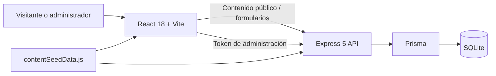

# DesarPro

> Plataforma web corporativa, portafolio y CMS de **DesarPro**, creada para que **Daniel Colorado** y **Alejandro Piedrahita** presenten sus servicios, publiquen proyectos, reciban contactos y administren el contenido de la empresa.

DesarPro es la presencia digital principal de la empresa: una experiencia visual de alto impacto para explicar capacidades de desarrollo de software, convertir visitas en oportunidades comerciales y mantener el portafolio actualizado sin editar código. Incluye un sitio público multilingüe y un panel administrativo protegido que persiste contenido, proyectos, servicios, leads, SEO y configuración global.

## Tabla de contenido

- [Propósito y alcance](#propósito-y-alcance)
- [Funciones principales](#funciones-principales)
- [Manual de usuario](#manual-de-usuario)
- [Arquitectura técnica](#arquitectura-técnica)
- [Modelo de datos](#modelo-de-datos)
- [API](#api)
- [Instalación y desarrollo](#instalación-y-desarrollo)
- [Variables de entorno](#variables-de-entorno)
- [Despliegue](#despliegue)
- [Operación y seguridad](#operación-y-seguridad)

## Propósito y alcance

La plataforma cumple dos objetivos complementarios:

1. **Sitio público de DesarPro.** Comunica la propuesta de valor de la empresa, sus servicios, tecnologías, proyectos, equipo y canales de contacto.
2. **Herramienta editorial interna.** Permite a Daniel y Alejandro administrar el contenido comercial y técnico desde un CMS, con versiones en español, inglés, portugués, francés y alemán.

La navegación utiliza rutas por hash, por lo que funciona correctamente en hospedajes estáticos sin reglas especiales de redirección: `#/`, `#/servicios`, `#/proyectos`, `#/nosotros`, `#/contacto`, `#/login` y `#/admin`.

## Funciones principales

### Experiencia pública

- Página principal con hero audiovisual, servicios destacados, tecnologías, proceso de trabajo y llamadas a la acción.
- Catálogo de servicios y vistas de detalle para desarrollo web, móvil, software a medida, IA, APIs, datos, cloud, seguridad, SEO, mantenimiento, consultoría y BI.
- Portafolio de proyectos con filtros, detalle, carrusel y contenido localizado.
- Página institucional, formulario de contacto y captura de leads.
- Internacionalización en **ES, EN, PT, FR y DE**.
- Tema claro/oscuro persistente, diseño responsive, SEO por ruta e integración de metadatos Open Graph.
- Componentes visuales y animaciones: video del hero, globo terráqueo, redes neuronales, asistentes holográficos, carruseles y fondos interactivos.

### CMS administrativo

- Inicio de sesión con sesiones almacenadas del lado del servidor.
- Edición de textos en vivo y por secciones, en los cinco idiomas.
- CRUD de proyectos con orden, publicación, destacados y traducciones.
- CRUD de servicios, tecnologías, SEO y configuración global del sitio.
- Bandeja de leads con búsqueda, estado comercial y notas.
- Exportación, importación y restablecimiento de contenido; antes de operaciones destructivas se guarda una instantánea de respaldo.
- Panel de métricas operativas para contenido, leads y catálogo.

## Manual de usuario

### Para visitantes

| Necesidad | Cómo hacerlo |
|---|---|
| Cambiar de idioma | Usar el selector de idioma de la barra superior. La preferencia queda guardada en el navegador. |
| Cambiar el tema | Usar el control claro/oscuro de la barra superior. |
| Explorar servicios | Abrir **Servicios**, seleccionar una categoría y consultar el detalle o CTA correspondiente. |
| Ver trabajos realizados | Abrir **Proyectos**, usar los filtros y navegar el carrusel o detalle del proyecto. |
| Solicitar contacto | Ir a **Contacto**, completar nombre, correo y mensaje; los campos adicionales ayudan a calificar la oportunidad. |

### Para administradores

1. Iniciar el frontend y la API (ver [Instalación y desarrollo](#instalación-y-desarrollo)).
2. Abrir `http://localhost:3000/#/login` y entrar al área administrativa, o navegar directamente a `#/admin`.
3. Iniciar sesión con el usuario creado por `npm run db:seed`.
4. Elegir una sección en el menú del CMS:
   - **Contenido:** textos por sección e idioma.
   - **Proyectos:** alta, edición, publicación, destacado, orden y traducciones.
   - **Leads:** consulta, búsqueda, notas y avance de estado (`new`, `contacted`, `in_progress`, `won`, `lost`).
   - **Servicios, tecnologías, SEO y configuración:** gestión del catálogo y de la presencia editorial.
5. Guardar cada cambio y comprobar el sitio público en el idioma correspondiente.

> **Credenciales de desarrollo:** si no se definen `ADMIN_EMAIL` y `ADMIN_PASSWORD`, el seed crea `admin@desarpro.com` / `Administrador01`. Nunca use esa contraseña predeterminada en producción.

### Exportar, importar o restablecer

- **Exportar:** descarga una representación JSON del contenido administrable.
- **Importar:** carga un JSON previamente exportado. Revise el archivo antes de confirmar.
- **Restablecer:** vuelve a los valores semilla. El sistema registra una instantánea previa para recuperación operativa.

## Arquitectura técnica



| Capa | Implementación | Responsabilidad |
|---|---|---|
| Interfaz | React 18 + Vite 5 + ESM | Rutas por hash, componentes, i18n, tema, CMS y UX. |
| Estilos | CSS nativo y `tokens.css` | Tokens de diseño, temas, responsive y animaciones. |
| API | Express 5 | Autenticación, contenido, proyectos, servicios, leads, SEO y configuración. |
| Persistencia | Prisma 5 + SQLite | Datos del CMS, sesiones, catálogos, leads y respaldos. |
| Seguridad | bcryptjs, tokens aleatorios y límites por IP | Contraseñas con hash, sesiones con expiración y mitigación básica de fuerza bruta/spam. |
| Build | Vite + `copy-build-assets.js` | Bundle ESM y copia de `media/`, `tokens.css` y `robots.txt` a `dist/`. |

### Frontend

- `src/main.jsx`: único punto de entrada; monta React en `#root`.
- `src/App.jsx`: composición de proveedores, SEO de ruta y router por hash.
- `src/pages/`: vistas públicas, login, CMS y gestores administrativos.
- `src/components/`: navegación, carruseles, escenas visuales, estados, notificaciones y componentes reutilizables.
- `src/lib/`: acceso a la API, administración, datos de servicios/proyectos, iconos, tema y animación.
- `src/i18n/`: traducciones y contexto de idioma.
- `src/lib/contentSeedData.js`: fuente semilla compartida por el backend y el navegador; evita divergencias entre los valores iniciales y el CMS.

### Rutas del frontend

| Ruta | Vista |
|---|---|
| `#/` | Inicio |
| `#/servicios` | Hub de servicios |
| `#/svc-*` | Detalle del servicio |
| `#/proyectos` | Portafolio |
| `#/nosotros` | Página institucional |
| `#/contacto` | Contacto y captura de leads |
| `#/login` | Acceso administrativo |
| `#/admin` | CMS |

## Modelo de datos

| Modelo | Finalidad |
|---|---|
| `User` | Administradores del sistema. |
| `Session` | Tokens de sesión, usuario asociado y fecha de expiración. |
| `ContentKey` / `ContentTranslation` | Claves editables y su valor por idioma. |
| `Project` / `ProjectTranslation` | Portafolio, publicación, métricas, etiquetas y traducciones. |
| `Lead` | Solicitudes recibidas desde el formulario y su seguimiento comercial. |
| `Service` / `ServiceTranslation` | Catálogo de servicios, textos, entregables y proceso por idioma. |
| `Technology` | Tecnologías visibles, orden y categoría. |
| `SeoEntry` | Metadatos SEO por ruta e idioma. |
| `SiteConfig` | Visibilidad de secciones, hero, anuncio y ajustes globales. |
| `ContentSnapshot` | Respaldos previos a importaciones o restablecimientos. |

El esquema completo está en [`prisma/schema.prisma`](prisma/schema.prisma). Las relaciones dependientes usan borrado en cascada cuando corresponde; por ejemplo, una sesión no sobrevive a la eliminación del usuario y las traducciones no sobreviven al recurso padre.

## API

Base local: `http://localhost:3001`. El cliente usa `VITE_API_URL` en despliegues remotos y detecta la API local durante desarrollo.

### Pública

| Método | Endpoint | Descripción |
|---|---|---|
| `GET` | `/api/health` | Estado de la API. |
| `GET` | `/api/content?lang=es` | Contenido público localizado. |
| `GET` | `/api/projects?lang=es` | Proyectos activos localizados. |
| `GET` | `/api/projects/:slug` | Detalle de un proyecto. |
| `GET` | `/api/services?lang=es` | Servicios activos localizados. |
| `GET` | `/api/technologies` | Tecnologías activas. |
| `GET` | `/api/seo?lang=es` | Metadatos de las rutas. |
| `GET` | `/api/site-config` | Configuración pública del sitio. |
| `POST` | `/api/contact` | Crea un lead; exige nombre, email y mensaje válidos. |
| `POST` | `/api/login` | Autentica y entrega un token de sesión. |

### Administración

Las rutas siguientes requieren `x-admin-token: <token>` o `Authorization: Bearer <token>`, además del rol `admin`.

| Recurso | Endpoints |
|---|---|
| Sesión | `POST /api/auth/logout` |
| Contenido | `GET /api/admin/content`, `PUT /api/admin/content`, `PUT /api/admin/content/:key` |
| Proyectos | `GET /api/admin/projects`, `POST /api/projects`, `PUT /api/projects/:slug`, `DELETE /api/projects/:slug` |
| Leads | `GET /api/admin/leads`, `PUT /api/admin/leads/:id`, `DELETE /api/admin/leads/:id` |
| Servicios | `GET /api/admin/services`, `POST /api/services`, `PUT /api/services/:slug`, `DELETE /api/services/:slug` |
| Tecnologías | `GET /api/admin/technologies`, `POST /api/technologies`, `DELETE /api/technologies/:id` |
| SEO | `GET /api/admin/seo`, `POST /api/admin/seo`, `DELETE /api/admin/seo/:route` |
| Configuración | `GET /api/admin/site-config`, `PUT /api/admin/site-config` |
| Operación CMS | `GET /api/admin/dashboard`, `GET /api/admin/content/export`, `POST /api/admin/content/import`, `POST /api/admin/content/reset` |

La API limita intentos de inicio de sesión y envíos de contacto en memoria. Para múltiples instancias se recomienda sustituir ese límite por una solución compartida (por ejemplo Redis o un gateway).

## Instalación y desarrollo

### Requisitos

- Node.js **18 o superior**.
- npm.
- Una base SQLite local (se crea mediante Prisma) para usar CMS y API.

### Puesta en marcha

```bash
git clone https://github.com/desarpro-prog/Desarpro.git
cd Desarpro
npm install
```

Crear el archivo de entorno:

```bash
# Linux/macOS
cp .env.example .env

# Windows PowerShell
Copy-Item .env.example .env
```

Preparar la base de datos y el usuario administrador:

```bash
npm run db:push
npm run db:seed
```

Iniciar frontend y backend conjuntamente:

```bash
npm run dev
```

- Frontend: `http://localhost:3000`
- API: `http://localhost:3001`
- Salud de API: `http://localhost:3001/api/health`

### Scripts disponibles

| Comando | Uso |
|---|---|
| `npm run dev` | Inicia Vite y Express en paralelo. |
| `npm run build` | Genera el build ESM de producción en `dist/` y copia assets estáticos. |
| `npm run preview` | Sirve localmente el build de Vite. |
| `npm run db:push` | Sincroniza el esquema Prisma con SQLite. |
| `npm run db:migrate` | Crea y aplica una migración Prisma llamada `cms`. |
| `npm run db:seed` | Crea/actualiza el contenido semilla y usuario administrador. |

## Variables de entorno

Tomar como referencia [`.env.example`](.env.example). No versionar `.env`.

| Variable | Uso | Ejemplo |
|---|---|---|
| `DATABASE_URL` | Ubicación de SQLite para Prisma. | `file:./dev.db` |
| `PORT` | Puerto de Express. | `3001` |
| `SESSION_TTL_MS` | Duración de las sesiones administrativas. | `604800000` |
| `CORS_ORIGIN` | Orígenes permitidos, separados por coma. | `https://desarpro.com` |
| `ADMIN_EMAIL` | Usuario creado o actualizado por el seed. | `admin@dominio.com` |
| `ADMIN_PASSWORD` | Contraseña inicial/actualizada por el seed. | Use un secreto robusto. |
| `VITE_API_URL` | URL pública de la API remota durante el build. No es secreto. | `https://api.ejemplo.com` |

## Despliegue

### Frontend estático en Vercel

El frontend está preparado para Vite y debe publicar **`dist/`**, no `src/`.

1. Conectar el repositorio a Vercel.
2. Usar el preset **Vite** (o configurar manualmente):
   - **Build Command:** `npm run build`
   - **Output Directory:** `dist`
   - **Node.js:** 18 o superior
3. Después de desplegar el backend (ver abajo), crear **`BACKEND_URL`** en Vercel con la URL HTTPS pública de la API, **sin barra final** (p. ej. `https://desarpro-api.up.railway.app`).
4. Redesplegar el frontend. El sitio usará el proxy `/api/*` del mismo dominio (`desarpro.vercel.app/api/...`), así login y CMS funcionan desde cualquier red sin CORS.
5. *(Opcional)* Si prefieres llamar al backend directamente, define `VITE_API_URL` en el build y configura `CORS_ORIGIN` en el backend.

`vercel.json` define cabeceras de seguridad y caché prolongada para `media/`. La carpeta `api/` incluye un proxy serverless hacia `BACKEND_URL`.

### API y base de datos en producción (Railway recomendado)

El CMS requiere una API Express disponible públicamente y una base de datos persistente. **Vercel solo sirve el frontend**; el backend va en un servicio Node con disco persistente.

#### Railway (Express + SQLite)

1. Crear proyecto en [Railway](https://railway.app) conectado a este repositorio.
2. Añadir un **volumen** montado en `/data`.
3. Variables de entorno en Railway:

| Variable | Valor |
|---|---|
| `DATABASE_URL` | `file:/data/prod.db` |
| `CORS_ORIGIN` | `https://desarpro.vercel.app` (y tu dominio custom si aplica) |
| `ADMIN_EMAIL` | tu correo admin |
| `ADMIN_PASSWORD` | contraseña segura |
| `PORT` | `3001` (Railway inyecta su propio puerto; opcional) |

4. Railway usará `railway.toml` → `npm run start:api` (Prisma push + seed + Express).
5. Generar dominio público en Railway (Settings → Networking → Generate Domain).
6. Copiar esa URL a **`BACKEND_URL`** en Vercel y redesplegar el frontend.

#### Verificar acceso remoto

- Salud API: `https://TU-BACKEND/api/health`
- Login: `https://desarpro.vercel.app/#/login`
- Admin: `https://desarpro.vercel.app/#/admin`

Desde móvil o cualquier red, las peticiones van a `desarpro.vercel.app/api/*` → proxy → tu backend.

> SQLite en un sistema de archivos efímero de serverless no garantiza persistencia. Para crecer, planifique una base de datos gestionada y la migración correspondiente de Prisma.

### Verificación antes de publicar

```bash
npm run build
npm run dev
```

Comprobar manualmente el home, los cinco idiomas, tema claro/oscuro, contacto, proyectos, servicios, login y CMS. Confirme además que la API responde en `/api/health` y que los assets bajo `dist/media/` se sirven correctamente.

## Operación y seguridad

- Cambie las credenciales predeterminadas antes de exponer la API.
- Mantenga `ADMIN_PASSWORD` únicamente en el gestor de secretos del entorno; nunca en Git ni en el frontend.
- `VITE_API_URL` sí puede ser pública: Vite la incorpora al build.
- Las sesiones usan tokens aleatorios de 32 bytes, se validan en servidor y expiran.
- Las contraseñas se procesan con bcrypt.
- Limite los orígenes CORS y opere la API exclusivamente sobre HTTPS en producción.
- Antes de importar o restablecer contenido, exporte una copia y valide que las instantáneas se estén creando.

## Créditos

**DesarPro** es la plataforma corporativa de **Daniel Colorado** y **Alejandro Piedrahita** para presentar, publicar y administrar el trabajo de la empresa.

© 2026 DesarPro · Desarrollo de software profesional · Pereira, Colombia.
