<div align="center">

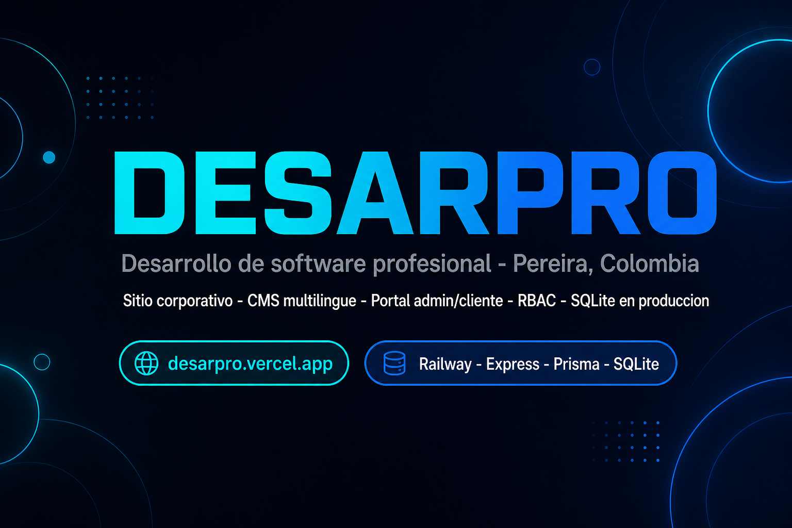

# DesarPro

**Plataforma corporativa, CMS multilingüe y portales admin/cliente para desarrollo de software profesional**

*Sitio público · Panel administrativo · Portal cliente · Chat · Entregables · Notificaciones*

<br/>

[](https://react.dev/)
[](https://vitejs.dev/)
[](https://expressjs.com/)
[](https://www.prisma.io/)
[](https://www.sqlite.org/)
[](https://vercel.com/)
[](https://railway.app/)

<br/>

[](https://desarpro.vercel.app)
[](https://desarpro.vercel.app)
[](https://desarpro-production.up.railway.app/api/health)
[](#-internacionalización)
[](#-tests-y-calidad)

<br/>

[🌐 Demo en vivo](https://desarpro.vercel.app) · [📖 Documentación producción](docs/PRODUCTION.md) · [🔐 Login portal](https://desarpro.vercel.app/#/login) · [🛡️ Admin](https://desarpro.vercel.app/#/admin)

---

</div>

## 📋 Índice

- [Resumen ejecutivo](#-resumen-ejecutivo)
- [Capturas de pantalla](#-capturas-de-pantalla)
- [Stack tecnológico](#-stack-tecnológico)
- [Arquitectura del sistema](#-arquitectura-del-sistema)
- [Estructura del proyecto](#-estructura-del-proyecto)
- [Instalación y configuración](#-instalación-y-configuración)
- [Variables de entorno](#-variables-de-entorno)
- [Base de datos SQLite](#-base-de-datos-sqlite)
- [Autenticación y RBAC](#-autenticación-y-rbac)
- [Módulos del sistema](#-módulos-del-sistema)
- [API Reference](#-api-reference)
- [Internacionalización](#-internacionalización)
- [Manual de usuario](#-manual-de-usuario)
- [Sistema de diseño y UX](#-sistema-de-diseño-y-ux)
- [Tests y calidad](#-tests-y-calidad)
- [Despliegue](#-despliegue)
- [Roadmap](#-roadmap)
- [Créditos](#-créditos)

---

## 🎯 Resumen ejecutivo

**DesarPro** es la plataforma digital de **Daniel Colorado** y **Alejandro Piedrahita**: un sitio corporativo de alto impacto visual, un **CMS administrativo** completo y **portales admin/cliente** con autenticación RBAC, chat, entregables, notificaciones, webhooks e integraciones.

```
┌─────────────────────────────────────────────────────────────────────┐
│                                                                       │
│   "Tecnología que transforma tu negocio — software a medida,         │
│    apps móviles, SaaS, IA e infraestructura para LATAM."             │
│                                                                       │
└─────────────────────────────────────────────────────────────────────┘
```

### ✨ Capacidades principales

| Capacidad | Descripción |
|-----------|-------------|
| 🌐 **Sitio corporativo** | Hero audiovisual, servicios, tecnologías, procesos, proyectos, contacto |
| 🌍 **5 idiomas** | ES · EN · PT · FR · DE con paridad verificada (226 claves) |
| 🎨 **CMS en vivo** | Edición de contenido, proyectos, servicios, SEO y configuración global |
| 🛡️ **Portal admin** | Dashboard, clientes, usuarios, proyectos, entregables, leads, permisos |
| 👤 **Portal cliente** | Dashboard, proyectos, chat, notificaciones, perfil y entregables |
| 🔐 **RBAC completo** | `super_admin` · `admin` · `client` con permisos granulares |
| 💬 **Mensajería** | Conversaciones admin↔cliente con historial persistente |
| 📦 **Entregables** | Subida/gestión de archivos por proyecto con notificaciones |
| 🔔 **Notificaciones** | In-app con contador, lectura individual y masiva |
| 🔗 **Webhooks** | Eventos configurables con deduplicación |
| 📧 **Email opcional** | SMTP para reset, aprobación, suspensión y alertas |
| 📱 **Mobile-first** | Login vía proxy `/api` same-origin — compatible Safari móvil |
| 🗄️ **SQLite persistente** | Railway Volume `/data/prod.db` en producción |

---

## 📸 Capturas de pantalla

> Capturas reales de producción — [desarpro.vercel.app](https://desarpro.vercel.app) · agosto 2026.

<table>
<tr>
<td width="50%">

### Home — Hero corporativo

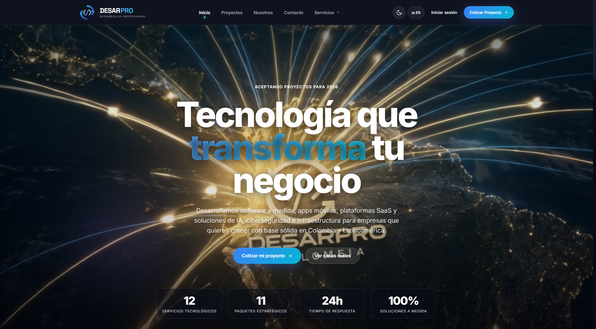

</td>
<td width="50%">

### Hub de servicios

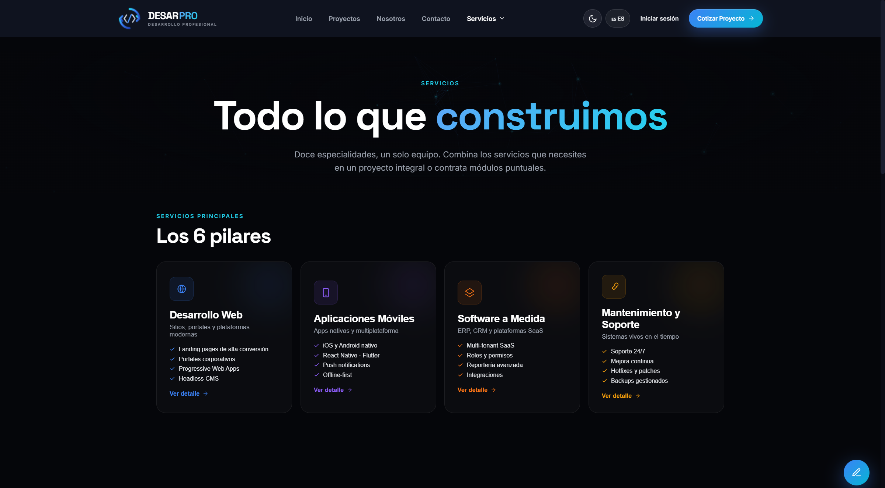

</td>
</tr>
<tr>
<td width="50%">

### Portafolio de proyectos

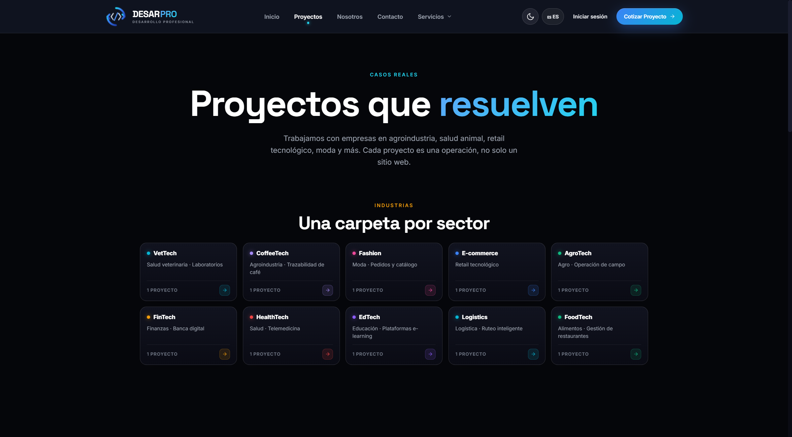

</td>
<td width="50%">

### Formulario de contacto

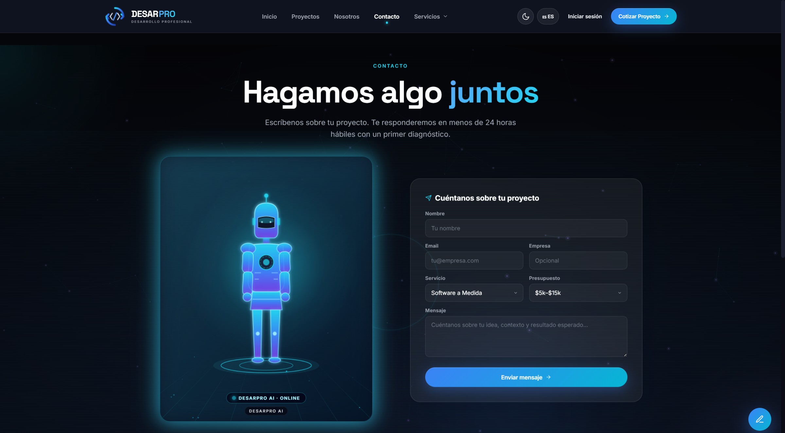

</td>
</tr>
<tr>
<td width="50%">

### Portal de login

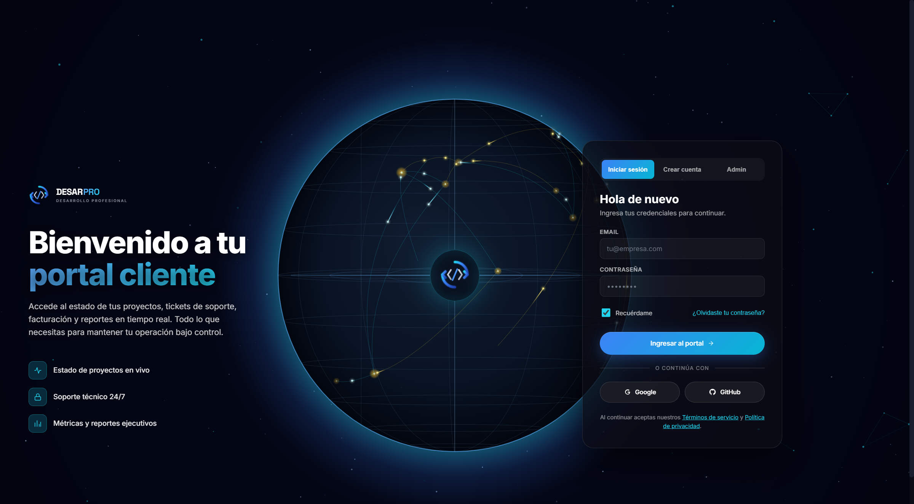

</td>
<td width="50%">

### Dashboard cliente

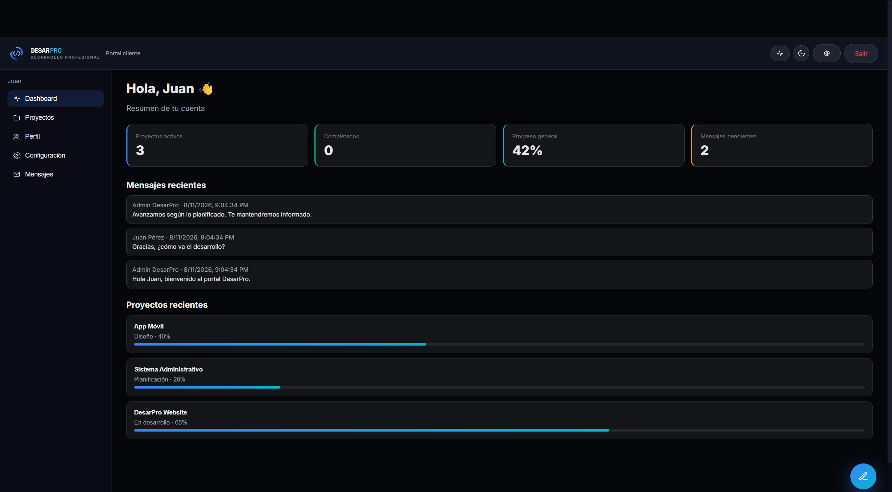

</td>
</tr>
<tr>
<td colspan="2">

### Panel administrativo

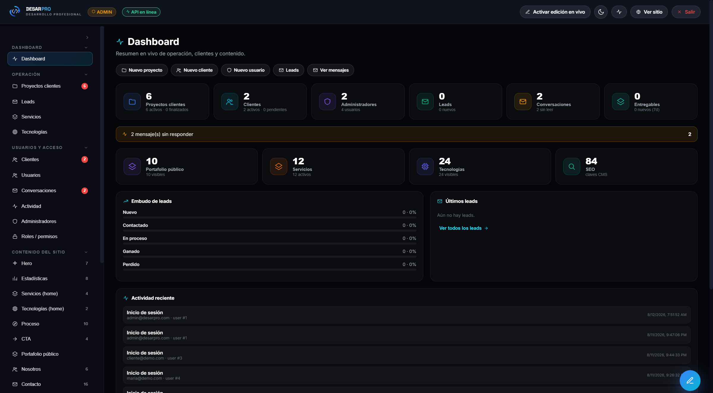

</td>
</tr>
</table>

| Vista | URL directa |
|-------|-------------|
| Sitio público | [desarpro.vercel.app](https://desarpro.vercel.app) |
| Login portal | [desarpro.vercel.app/#/login](https://desarpro.vercel.app/#/login) |
| Portal cliente | [desarpro.vercel.app/#/client](https://desarpro.vercel.app/#/client) |
| Panel admin | [desarpro.vercel.app/#/admin](https://desarpro.vercel.app/#/admin) |
| Servicios | [desarpro.vercel.app/#/servicios](https://desarpro.vercel.app/#/servicios) |
| Contacto | [desarpro.vercel.app/#/contacto](https://desarpro.vercel.app/#/contacto) |

---

## 🔧 Stack tecnológico

### Frontend

| Tecnología | Versión | Rol |
|------------|---------|-----|
|  | 18.3 | UI con hooks, contextos y rutas hash |
|  | 5.4 | Build ESM, HMR en desarrollo |
| CSS nativo + `tokens.css` | — | Design tokens, temas claro/oscuro, responsive |
| Hash routing | — | `#/`, `#/admin`, `#/client` — compatible hosting estático |

### Backend & Infraestructura

| Tecnología | Versión | Rol |
|------------|---------|-----|
|  | 20+ | Runtime Express |
|  | 5.2 | API REST, CORS, rate limit, sesiones |
|  | 5.22 | ORM type-safe |
|  | 3.x | BD en dev (`./dev.db`) y prod (`/data/prod.db`) |
|  | — | Frontend estático + proxy `/api/*` |
|  | — | Backend Docker + Volume persistente |
| bcryptjs | 3.0 | Hash de contraseñas |
| nodemailer | 6.9 | SMTP opcional |

### DevTools & QA

| Herramienta | Uso |
|-------------|-----|
| `smoke-test.js` | 56 pruebas API (auth, RBAC, ownership, CMS) |
| `scripts/i18n-parity-check.js` | Paridad 226×5 idiomas |
| `scripts/browser-test.js` | 280 pruebas E2E con Puppeteer + Chrome |
| `scripts/admin-verify.js` | E2E del CMS admin |
| `scripts/verify-production.js` | Checklist post-deploy producción |

---

## 🏛️ Arquitectura del sistema

### Vista general — Producción

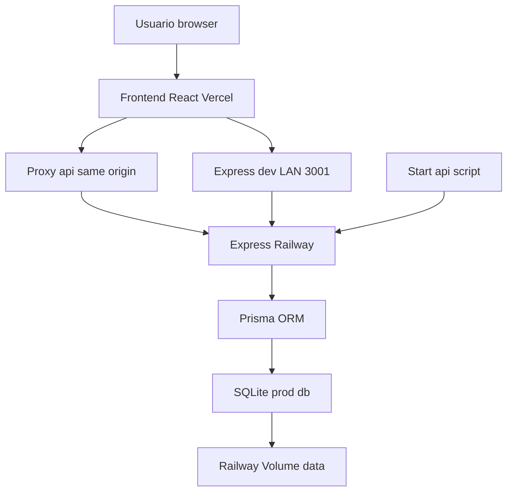

<details>
<summary>Diagrama ASCII (fallback si Mermaid no carga)</summary>

```
Usuario (browser/movil)
        |
        v
  Vercel - React static
        |
        +-- prod --> /api/* proxy same-origin --> Railway Express
        |
        +-- dev/LAN --> hostname:3001 directo --> Express local
                              |
                              v
                    Prisma 5 --> SQLite (dev.db o /data/prod.db)
```

</details>

### Resolución de API (frontend)

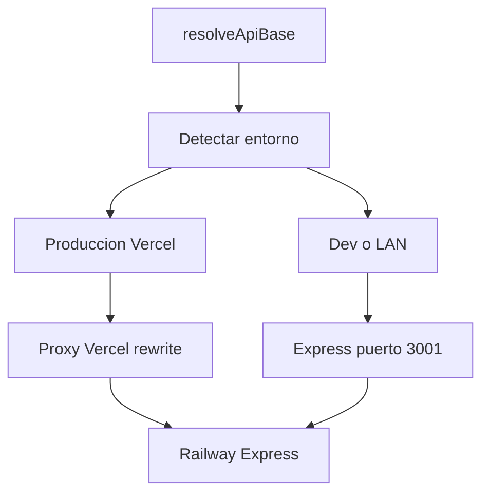

<details>
<summary>Diagrama ASCII resolveApiBase</summary>

```
resolveApiBase()
       |
       +-- dev/LAN (localhost, 192.168.x.x, :5173)
       |         -> http://hostname:3001  -> Express local
       |
       +-- produccion (desarpro.vercel.app)
                 -> base vacia ""        -> /api/* same-origin
                 -> vercel.json rewrite  -> Railway Express
```

</details>

<details>
<summary>Tabla resolveApiBase</summary>

| Entorno | Host detectado | API base | Resultado |
|---------|----------------|----------|-----------|
| Dev Vite | `localhost:5173` | `http://localhost:3001` | Directo al Express local |
| Dev LAN | `192.168.x.x:5173` | `http://192.168.x.x:3001` | API en la misma máquina/red |
| Producción | `desarpro.vercel.app` | `""` (vacío) | Same-origin `/api/*` vía proxy Vercel |
| Preview Vercel | `*.vercel.app` | `""` (vacío) | Mismo proxy, evita CORS móvil |

</details>

> **Importante móvil:** en producción las peticiones van a `desarpro.vercel.app/api/...`, **no** cross-origin a Railway. Esto evita bloqueos CORS en Safari iOS.

### Flujo de autenticación

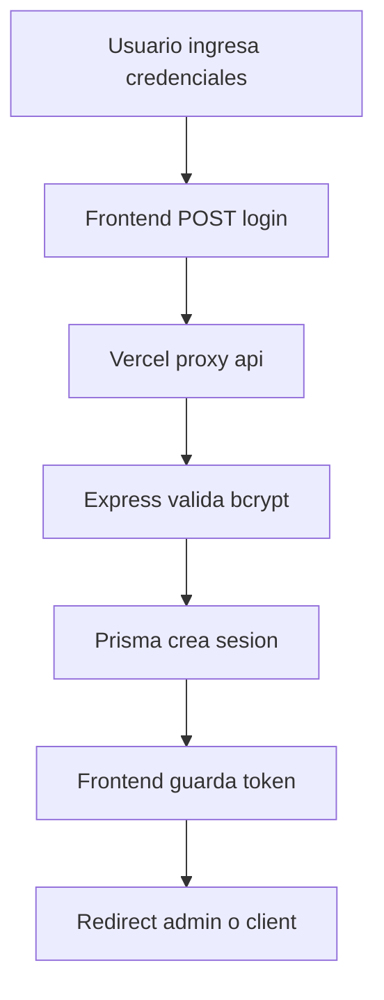

<details>
<summary>Diagrama ASCII flujo login</summary>

```
Usuario --> Frontend : email + password
Frontend --> Vercel proxy : POST /api/login
Vercel proxy --> Express : forward
Express --> Prisma : findUnique + bcrypt
Prisma --> Express : usuario valido
Express --> Prisma : create Session
Express --> Frontend : { ok, token, user }
Frontend --> Frontend : sessionStorage
Frontend --> Usuario : redirect #/admin o #/client
```

</details>

### RBAC — Roles y destinos

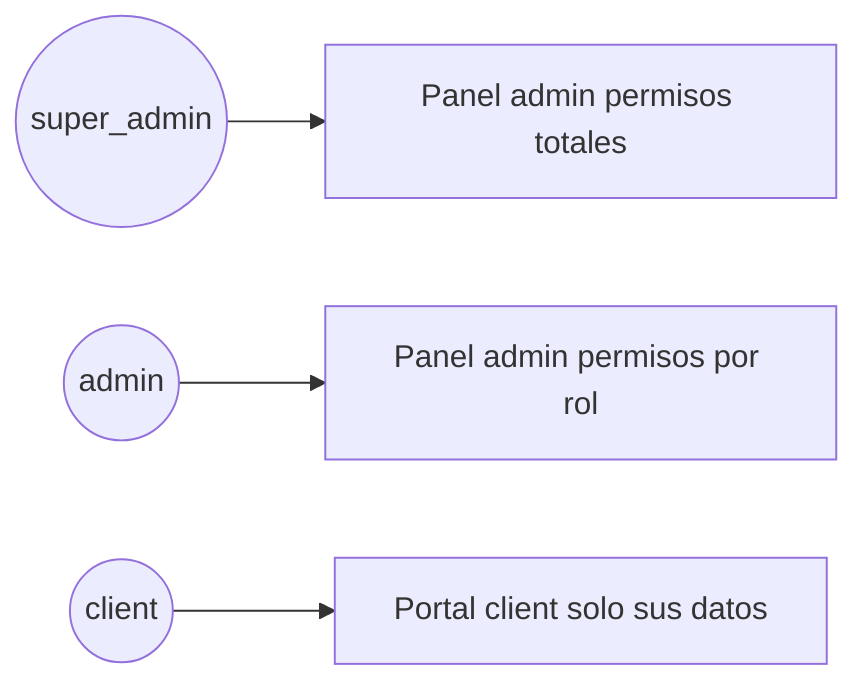

### Flujo CMS y portales

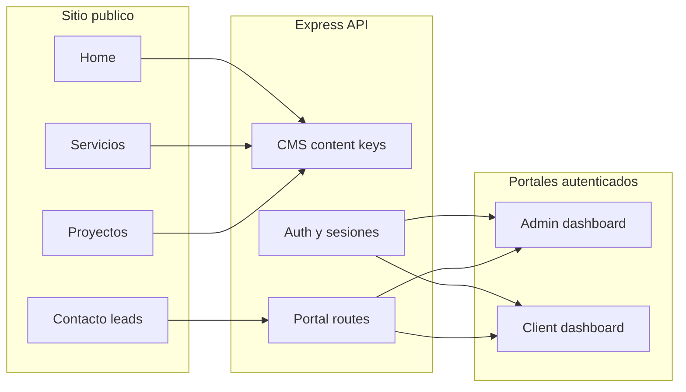

### Seed idempotente (producción)

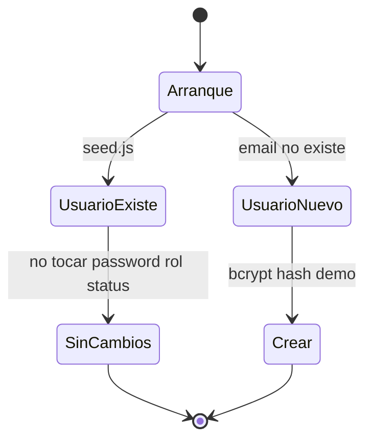

> `SEED_RESET_PASSWORDS=1` solo debe usarse manualmente y con autorización explícita.

---

## 📁 Estructura del proyecto

```
desarpro-full/
│
├── 📄 server.js                 # Express principal + CMS routes
├── 📄 seed.js                   # Seed idempotente (prod-safe)
├── 📄 smoke-test.js             # 56 pruebas de integración API
├── 📄 Dockerfile                # Imagen Railway (API + Prisma + SQLite)
├── 📄 railway.toml              # Deploy Railway: start:api + healthcheck
├── 📄 vercel.json               # Rewrite /api + security headers
├── 📄 index.html                # Meta desarpro:api + bootstrap API base
├── 📄 tokens.css                # Design tokens globales
│
├── 📁 prisma/
│   └── schema.prisma            # 20+ modelos SQLite
│
├── 📁 server/
│   ├── authUtils.js             # Sesiones, serialización, activity log
│   ├── permissions.js           # RBAC — PERMISSIONS + requirePermission
│   ├── portalRoutes.js          # Admin/cliente: users, projects, chat…
│   ├── integrationsRoutes.js    # SMTP status, webhooks
│   ├── emailService.js          # Nodemailer + templates
│   └── webhookService.js        # Dispatch eventos
│
├── 📁 scripts/
│   ├── start-api.js             # Arranque prod: /data, prisma, seed, express
│   ├── inject-api-url.js        # Inyecta VITE_API_URL en dist/
│   ├── build-local.js           # Build E2E con API localhost
│   ├── verify-production.js     # Checklist post-deploy
│   ├── browser-test.js          # 280 E2E browser
│   └── admin-verify.js          # E2E CMS admin
│
├── 📁 src/
│   ├── main.jsx                 # Entry React
│   ├── App.jsx                  # Router hash + providers
│   ├── pages/                   # Home, Admin, ClientApp, Login…
│   ├── components/              # Navbar, carruseles, globo 3D, portal UI
│   ├── lib/                     # apiBase, admin, portalData, serviceData
│   └── i18n/                    # translations.jsx + 5 idiomas
│
├── 📁 docs/
│   ├── PRODUCTION.md            # Guía Railway + Volume + variables
│   └── readme/                  # Screenshots + banner para README
│
└── 📁 dist/                     # Build Vite (generado)
```

---

## 🚀 Instalación y configuración

### Prerrequisitos

```bash
Node.js  >= 18.x
npm      >= 10.x
Git      >= 2.x
```

### 1. Clonar el repositorio

```bash
git clone https://github.com/desarpro-prog/Desarpro.git
cd Desarpro
```

### 2. Instalar dependencias

```bash
npm install
# Ejecuta postinstall → prisma generate
```

### 3. Configurar entorno local

```bash
# Windows PowerShell
Copy-Item .env.example .env

# Linux/macOS
cp .env.example .env
```

### 4. Base de datos local

```bash
npm run db:push
npm run db:seed
```

### 5. Desarrollo

```bash
npm run dev
```

| Servicio | URL |
|----------|-----|
| Frontend Vite | http://localhost:5173 |
| API Express | http://localhost:3001 |
| Health | http://localhost:3001/api/health |
| Admin CMS | http://localhost:5173/#/admin |
| Login | http://localhost:5173/#/login |

### Scripts disponibles

| Comando | Descripción |
|---------|-------------|
| `npm run dev` | Vite + Express en paralelo |
| `npm run build` | Build producción → `dist/` |
| `npm run build:local` | Build E2E con API en `:3001` |
| `npm run preview` | Preview del build Vite |
| `npm run start` | Solo Express (sin setup) |
| `npm run start:api` | Prod: prisma + seed + Express |
| `npm run db:push` | Sincronizar schema SQLite |
| `npm run db:seed` | Seed idempotente |
| `npm run test:smoke` | 56 pruebas API |
| `npm run i18n:check` | Paridad i18n 226×5 |
| `npm run test:e2e:browser` | 280 E2E browser |
| `npm run test:e2e:admin` | E2E CMS admin |
| `npm run verify:prod` | Verificar producción live |

---

## 🔐 Variables de entorno

Ver [`.env.example`](.env.example) y [`docs/PRODUCTION.md`](docs/PRODUCTION.md).

### Railway (backend)

| Variable | Producción | Secreta |
|----------|------------|---------|
| `DATABASE_URL` | `file:/data/prod.db` | No* |
| `NODE_ENV` | `production` | No |
| `CORS_ORIGIN` | `https://desarpro.vercel.app` | No |
| `APP_URL` | `https://desarpro.vercel.app` | No |
| `FRONTEND_URL` | `https://desarpro.vercel.app` | No |
| `SESSION_TTL_MS` | `604800000` | No |
| `ADMIN_EMAIL` | `admin@desarpro.com` | No |
| `ADMIN_PASSWORD` | *(mantener actual)* | **Sí** |
| `RUN_DB_SETUP` | `0` tras estabilizar | No |
| `SEED_ON_START` | `0` tras estabilizar | No |
| `SMTP_*` | según proveedor | **Sí** |

### Vercel (frontend)

| Variable | Valor |
|----------|-------|
| `VITE_API_URL` | `https://desarpro-production.up.railway.app` *(opcional — proxy `/api` funciona sin ella en browser)* |

### Local (`.env`)

```env
DATABASE_URL="file:./dev.db"
NODE_ENV=development
CORS_ORIGIN=http://localhost:5173
PORT=3001
```

---

## 🗄️ Base de datos SQLite

| Entorno | Ruta | Persistencia |
|---------|------|--------------|
| Desarrollo | `file:./dev.db` | Archivo local |
| Producción | `file:/data/prod.db` | **Railway Volume** `desarpro-volume` |

### Diagrama ER (simplificado)

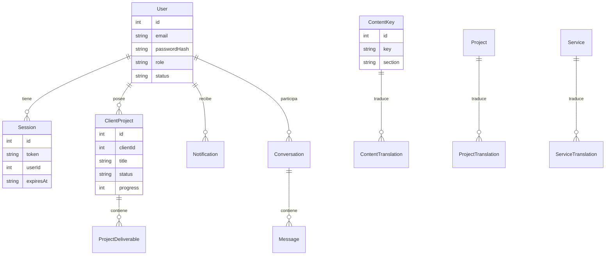

### Modelos Prisma (20)

`User` · `Session` · `PasswordResetToken` · `ClientProject` · `ProjectDeliverable` · `Conversation` · `Message` · `Notification` · `Webhook` · `ActivityLog` · `ContentKey` · `ContentTranslation` · `Project` · `ProjectTranslation` · `Lead` · `Service` · `ServiceTranslation` · `Technology` · `SeoEntry` · `SiteConfig` · `ContentSnapshot`

> **No migrar a PostgreSQL** sin plan explícito. La arquitectura actual está optimizada para SQLite + Volume Railway.

---

## 🔑 Autenticación y RBAC

### Roles

| Rol | Destino | Capacidades |
|-----|---------|-------------|
| `super_admin` | `#/admin` | Todos los permisos + gestión de roles |
| `admin` | `#/admin` | Según matriz de permisos asignada |
| `client` | `#/client` | Solo proyectos/datos propios (ownership) |

### Usuarios demo (desarrollo / staging)

| Email | Rol | Password | Destino |
|-------|-----|----------|---------|
| `super@desarpro.com` | super_admin | `Android.13` | `#/admin` |
| `admin@desarpro.com` | admin | `Android.13` | `#/admin` |
| `cliente@demo.com` | client | `Android.13` | `#/client` |
| `maria@demo.com` | client | `Android.13` | `#/client` |

> ⚠️ **No resetear contraseñas en producción** sin autorización. El seed es idempotente: usuarios existentes no se modifican.

### Seguridad implementada

- ✅ bcrypt para contraseñas
- ✅ Tokens de sesión aleatorios (32 bytes) con TTL configurable
- ✅ Rate limiting en login y contacto
- ✅ RBAC backend con `requirePermission`
- ✅ Ownership: cliente A **no** accede a datos de cliente B (403/404)
- ✅ CORS restringido en producción
- ✅ Secretos solo en Railway — nunca en Vercel build
- ✅ Reset tokens hasheados (no plaintext)
- ✅ Headers de seguridad en `vercel.json`

---

## 📦 Módulos del sistema

### 🏠 Sitio público

| Ruta hash | Módulo |
|-----------|--------|
| `#/` | Home — hero, servicios, tech loop, proceso, CTA |
| `#/servicios` | Hub de 12 servicios tecnológicos |
| `#/svc-*` | Detalle de servicio con entregables y proceso |
| `#/proyectos` | Portafolio, carrusel, paquetes estratégicos |
| `#/nosotros` | Misión, visión, valores, fundadores |
| `#/contacto` | Formulario → Lead en BD |
| `#/login` | Portal cliente + pestaña Admin |

### 🛡️ Portal administrativo (`#/admin`)

| Sección | Funcionalidad |
|---------|--------------|
| Dashboard | KPIs, alertas, métricas operativas |
| CMS Contenido | 84+ claves editables × 5 idiomas |
| Proyectos catálogo | CRUD portafolio público |
| Clientes | CRUD, estados, conversión leads |
| Proyectos cliente | CRUD con progreso, prioridad, entregables |
| Usuarios | CRUD + RBAC + reset password |
| Leads | Bandeja comercial con estados |
| Servicios / Tech / SEO | Catálogos editables |
| Mensajes | Chat con clientes |
| Notificaciones | Centro de alertas |
| Integraciones | SMTP, webhooks, email test |
| Configuración | Site config, settings generales |

### 👤 Portal cliente (`#/client`)

| Sección | Funcionalidad |
|---------|--------------|
| Dashboard | Resumen de proyectos activos |
| Proyectos | Lista y detalle con timeline |
| Mensajes | Chat con equipo DesarPro |
| Entregables | Descarga de archivos por proyecto |
| Notificaciones | Alertas de estado y entregas |
| Perfil / Settings | Datos personales |

---

## 🌐 API Reference

**Base producción:** `https://desarpro-production.up.railway.app`  
**Proxy Vercel:** `https://desarpro.vercel.app/api/*`

### Salud

```http
GET /api/health
```

```json
{
  "ok": true,
  "message": "API lista",
  "environment": "production",
  "database": { "connected": true, "provider": "sqlite" }
}
```

### Pública

| Método | Endpoint | Auth |
|--------|----------|------|
| `GET` | `/api/health` | ❌ |
| `GET` | `/api/content?lang=es` | ❌ |
| `GET` | `/api/projects?lang=es` | ❌ |
| `GET` | `/api/services?lang=es` | ❌ |
| `GET` | `/api/technologies` | ❌ |
| `GET` | `/api/seo?lang=es` | ❌ |
| `GET` | `/api/site-config` | ❌ |
| `POST` | `/api/contact` | ❌ |
| `POST` | `/api/login` | ❌ |
| `POST` | `/api/auth/register` | ❌ |
| `POST` | `/api/auth/forgot-password` | ❌ |

### Autenticada (`x-admin-token`)

| Grupo | Endpoints destacados |
|-------|---------------------|
| CMS | `/api/admin/content`, `PUT /api/admin/content/:key` |
| Catálogo | `/api/projects`, `/api/services`, `/api/technologies` |
| Portal admin | `/api/admin/users`, `/api/admin/clients`, `/api/admin/client-projects` |
| Portal cliente | `/api/client/dashboard`, `/api/client/projects` |
| Chat | `/api/conversations`, `/api/conversations/:id/messages` |
| Notificaciones | `/api/notifications`, `PATCH /api/notifications/read-all` |
| Entregables | `/api/admin/deliverables`, `/api/client/deliverables` |
| Integraciones | `/api/admin/integrations/status`, `/api/admin/webhooks` |

> Lista completa en [`server.js`](server.js) + [`server/portalRoutes.js`](server/portalRoutes.js).

---

## 🌍 Internacionalización

| Idioma | Código | Estado |
|--------|--------|--------|
| 🇪🇸 Español | `es` | Default + CMS source |
| 🇺🇸 English | `en` | ✅ Paridad |
| 🇧🇷 Português | `pt` | ✅ Paridad |
| 🇫🇷 Français | `fr` | ✅ Paridad |
| 🇩🇪 Deutsch | `de` | ✅ Paridad |

```bash
npm run i18n:check
# → i18n parity OK (226 keys × 5 langs)
```

---

## 📖 Manual de usuario

### Visitante

1. Explorar servicios en `#/servicios`
2. Ver casos en `#/proyectos`
3. Contactar en `#/contacto`
4. Cambiar idioma/tema desde el header

### Cliente

1. Ir a [#/login](https://desarpro.vercel.app/#/login)
2. Pestaña **Iniciar sesión** → credenciales
3. Redirección automática a `#/client`
4. Consultar proyectos, chat y entregables

### Administrador

1. `#/login` → pestaña **Admin**
2. Email + contraseña admin
3. Panel completo en `#/admin`
4. Editar CMS, gestionar clientes y proyectos

### Desde móvil

Usar **https://desarpro.vercel.app** directamente. Las peticiones API van por proxy same-origin — no requiere configuración extra.

---

## 🎨 Sistema de diseño y UX

### Paleta DesarPro

| Token | Color | Uso |
|-------|-------|-----|
| `--bg-0` | `#05060A` | Fondo principal dark |
| `--accent-cyan` | `#22D3EE` | Highlights, gradientes hero |
| `--accent-blue` | `#3B82F6` | CTAs, links activos |
| `--accent-orange` | `#F59E0B` | Admin, badges premium |
| `--text-primary` | `#F8FAFC` | Texto principal |

### Componentes visuales destacados

- 🌍 **EarthGlobeScene** — globo 3D en login
- 🎬 **Hero video** — background cinematográfico
- 🔄 **TechLoop** — carrusel infinito de tecnologías
- 📊 **ProjectCarousel** — casos por industria
- 🌓 **Tema claro/oscuro** persistente en `localStorage`

### Responsive

| Breakpoint | Comportamiento |
|------------|----------------|
| `< 640px` | Menú hamburguesa, grids 1 col |
| `< 980px` | Login en columna única |
| `≥ 1024px` | Nav completa, layout 2 columnas |

---

## ✅ Tests y calidad

### Cobertura por suite

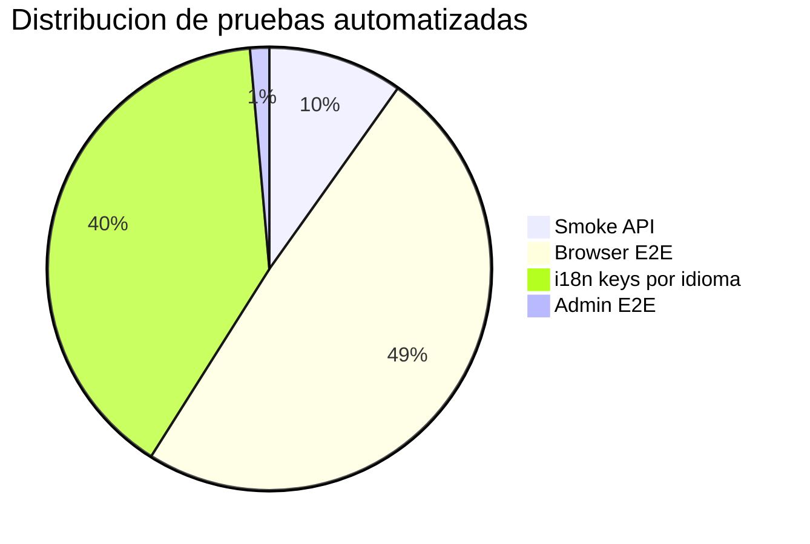

| Suite | Resultado | Comando |
|-------|-----------|---------|
| Build | ✅ PASS | `npm run build` |
| Smoke API | ✅ **56/56** | `npm run test:smoke` |
| i18n parity | ✅ **226×5** | `npm run i18n:check` |
| Browser E2E | ✅ **280/280** | `npm run build:local` + `npm run test:e2e:browser` |
| Admin E2E | ✅ **8/8** | `npm run build:local` + `npm run test:e2e:admin` |
| Prod verify | ✅ 9/10 | `npm run verify:prod` |

### Pipeline local recomendado

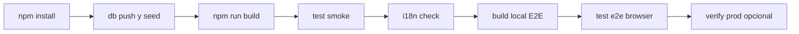

---

## 🚢 Despliegue

### Pipeline CI/CD

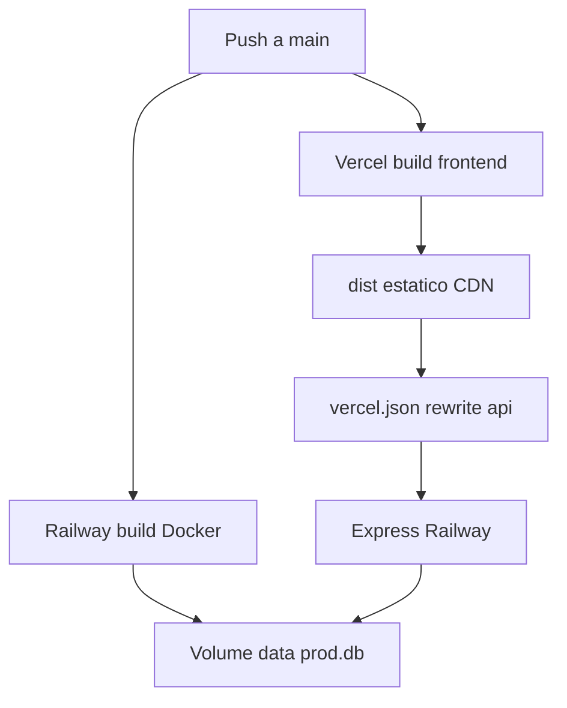

### Arquitectura producción

```
┌──────────────────────────────────────────────────────────────┐
│                      PRODUCCIÓN DESARPRO                      │
│                                                               │
│  ┌─────────────────┐         ┌──────────────────────────┐   │
│  │     Vercel      │  /api   │        Railway            │   │
│  │  React static   │ ──────► │  Express + Prisma         │   │
│  │  vercel.json    │  proxy  │  Docker + start-api.js    │   │
│  └─────────────────┘         │  Volume → /data/prod.db   │   │
│                               └──────────────────────────┘   │
└──────────────────────────────────────────────────────────────┘
```

| Servicio | URL |
|----------|-----|
| 🌐 Frontend | https://desarpro.vercel.app |
| ⚙️ API | https://desarpro-production.up.railway.app |
| ❤️ Health | https://desarpro-production.up.railway.app/api/health |

### Checklist Railway

- [x] Volume `desarpro-volume` montado en `/data`
- [x] `DATABASE_URL=file:/data/prod.db`
- [ ] `CORS_ORIGIN=https://desarpro.vercel.app` *(sin `*.vercel.app`)*
- [x] Dockerfile incluye carpeta `server/`
- [x] Health reporta `database.connected: true`

Guía completa: [`docs/PRODUCTION.md`](docs/PRODUCTION.md)

---

## 🗺️ Roadmap

```
✅ COMPLETADO
├── Sitio corporativo multilingüe (5 idiomas)
├── CMS admin completo
├── Portal cliente + admin con RBAC
├── Chat, notificaciones, entregables
├── Webhooks + integraciones SMTP
├── Despliegue Vercel + Railway + SQLite persistente
├── Login móvil vía proxy same-origin
├── Seed idempotente producción
└── 56 smoke + 280 browser E2E

🔄 EN CURSO
├── Restringir CORS a solo desarpro.vercel.app
├── RUN_DB_SETUP=0 / SEED_ON_START=0 en prod estable
└── SMTP producción (cuando haya proveedor)

🔜 PRÓXIMO
├── Dominio custom desarpro.com
├── PWA + push notifications
├── Panel analytics avanzado
└── Escalar BD si crece tráfico (evaluación futura)
```

---

## 👥 Créditos

<div align="center">

### Desarrollado por

| | |
|---|---|
| **Daniel Colorado** | Frontend · UI/UX · CMS · Animaciones |
| **Alejandro Piedrahita** | Backend · DevOps · RBAC · Arquitectura |

<br/>

**DesarPro** · Pereira, Colombia · 2026

[](https://github.com/desarpro-prog/Desarpro)
[](https://desarpro.vercel.app)

*"Tecnología que transforma tu negocio"*

</div>
